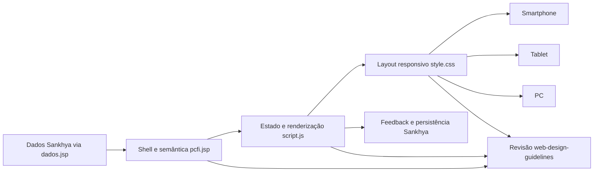

# Evolução da interface PCFI para uso multiplataforma — Design

**Spec**: `.specs/features/evolucao-ui-pcfi-multidispositivo/spec.md`
**Status**: Draft — abordagem recomendada aguardando aprovação

## Architecture Overview

### Abordagens consideradas

| Abordagem | Vantagens | Riscos | Avaliação |
| --- | --- | --- | --- |
| Refatoração incremental no JSP, CSS e JavaScript atuais | Preserva APIs, permissões, dados em memória e integração Sankhya | Exige organizar código legado gradualmente | **Recomendada** |
| Reescrita do dashboard em componentes vanilla separados | Melhora a separação de responsabilidades desde o início | Maior risco de regressão e duplicação durante a migração | Alternativa futura |
| Adotar framework ou novo build | Facilita componentes e testes modernos | Incompatível com o pacote atual e aumenta dependências/deploy | Fora do escopo |

A abordagem recomendada mantém o runtime atual e evolui a interface em fatias
verificáveis. O JSP continua fornecendo estrutura e dados; o JavaScript mantém
estado, renderização e chamadas ao Sankhya; o CSS concentra tokens, layout e
breakpoints.



## Code Reuse Analysis

### Existing Components to Leverage

| Component | Location | How to Use |
| --- | --- | --- |
| Shell, views e modais | `link/pcfi.jsp` | Preservar IDs e estados existentes enquanto melhora semântica e hierarquia |
| Consultas e datasets | `link/dados.jsp` | Não alterar; continuar usando os mesmos contratos de dados |
| Estado e fluxo de navegação | `link/javascript/script.js` | Estender renderização e navegação sem trocar as APIs Sankhya |
| Fábrica de campos | `link/javascript/script.js:78` | Evoluir para gerar IDs, names, required e descrições acessíveis |
| Validação atual | `link/javascript/script.js:92` | Reaproveitar regras de negócio e adicionar apresentação por campo |
| Tokens e breakpoints atuais | `link/css/style.css` | Formatar e evoluir, preservando a paleta operacional |
| Persistência e anexos | `link/javascript/script.js:30`, `link/javascript/script.js:102` | Não substituir; validar regressão durante a revisão |

### Integration Points

| System | Integration Method |
| --- | --- |
| Sankhya HTML5 | JSP com `<snk:load>` e inclusão de `dados.jsp` |
| Dados | Datasets expostos em `data-*` no `data-root` |
| Persistência | `CRUDServiceProvider.saveRecord` via `apiSave` |
| Anexos | Upload de sessão e `AnexoSistemaSP.salvar` |
| Autorização | Flags carregadas por pedido e aplicadas por etapa |

## Components

### Shell e navegação do dashboard

- **Purpose**: Exibir as três etapas, o contexto atual e a ação principal de
  cada tela.
- **Location**: `link/pcfi.jsp` e renderização correspondente em
  `link/javascript/script.js`.
- **Interfaces**: views `viewLista`, `viewPcfis` e `viewConferencia`; ações de
  abertura, retorno, atualização e salvamento.
- **Dependencies**: IDs existentes, datasets do JSP e permissões por etapa.
- **Reuses**: `topbar`, `context-card`, `view` e botões atuais.

### Formulário de conferência

- **Purpose**: Organizar campos por finalidade e apresentar apenas a
  complexidade necessária para a etapa atual.
- **Location**: `link/pcfi.jsp` e funções `field`, `renderItens` e `renderSubs`
  em `link/javascript/script.js`.
- **Interfaces**: quantidade recebida, qualidade, lotes, patrimônios, foto e
  observações; todos os valores continuam no objeto `state.itens`.
- **Dependencies**: regras existentes em `validar`, `prepararItens` e
  `salvar`.
- **Reuses**: classes `field`, `item-card`, `conditional`, `subrow` e dados
  normalizados atuais.

### Layout responsivo e direção visual

- **Purpose**: Adaptar leitura, campos e ações para touch e ponteiro sem
  fragmentar a experiência.
- **Location**: `link/css/style.css`.
- **Interfaces**: breakpoints mobile até 600px, tablet até 1024px e desktop;
  estados de foco, hover, erro, loading e reduced motion.
- **Dependencies**: classes e IDs mantidos no JSP/JavaScript.
- **Reuses**: variáveis CSS, paleta PCFI, badges, painéis e cartões existentes.

### Feedback, modais e segurança de navegação

- **Purpose**: Comunicar progresso e erros e impedir perda acidental de edição.
- **Location**: modais em `link/pcfi.jsp` e controle de estado em
  `link/javascript/script.js`.
- **Interfaces**: loading, toast, confirmação, qualidade, fiscal e câmera.
- **Dependencies**: eventos atuais de salvamento, câmera e retorno.
- **Reuses**: `confirmar`, `loading`, `toast` e restauração do foco existente na
  confirmação.

## Data Models

Não haverá alteração no modelo persistido. A interface continuará usando os
datasets e entidades atuais.

### ViewState

```text
pedido: Pedido | null
pcfi: Pcfi | null
etapa: QTDE | QUAL | FISC | ''
itens: ItemConferencia[]
paginaPedidos: number
pedidosFiltrados: Pedido[]
```

### FieldPresentation

Modelo apenas de apresentação, derivado do estado atual:

```text
id: string
name: string
label: string
type: text | number | date | select | textarea | checkbox
required: boolean
describedBy: string | null
invalid: boolean
```

## Responsive Behavior

| Contexto | Comportamento |
| --- | --- |
| Smartphone, até 600px | Uma coluna; ações em largura total; sublinhas de lote/patrimônio empilhadas; tabela com rolagem controlada |
| Tablet, 601–1024px | Grade adaptativa; contexto em uma ou duas colunas conforme largura; tabela sem truncar a ação principal |
| Desktop, acima de 1024px | Tabela completa; formulário com agrupamentos em múltiplas colunas; largura máxima controlada |
| Orientação alterada | Refluxo de layout sem ocultar campos essenciais |

## Error Handling Strategy

| Error Scenario | Handling | User Impact |
| --- | --- | --- |
| Busca sem correspondência | Estado vazio específico e ação para limpar busca | Usuário entende que o filtro pode ser removido |
| Campo inválido | Erro junto ao campo, `aria-invalid` e foco no primeiro erro | Correção direta sem procurar a origem no toast |
| Falha de salvamento | Preservar estado em memória e informar próxima ação | Usuário não perde o preenchimento |
| Câmera indisponível | Mensagem contextual e retorno seguro ao formulário | Conferência continua quando a foto não for obrigatória |
| Modal aberto | Foco controlado, `Esc`, fechamento seguro e foco restaurado | Navegação consistente em teclado e touch |
| Conteúdo longo | Quebra, truncamento reversível ou detalhe acessível | Layout não se desloca nem esconde a ação |

## Risks & Concerns

| Concern | Location (file:line) | Impact | Mitigation |
| --- | --- | --- | --- |
| Interação por duplo clique | `link/javascript/script.js:67` | Usuários de touch e teclado podem não descobrir a abertura | Renderizar ação explícita e remover dependência de `dblclick` |
| CSS inteiro minificado | `link/css/style.css:2-14` | Evolução responsiva fica sujeita a regressões | Formatar por blocos e validar cada breakpoint |
| Renderização via `innerHTML` | `link/javascript/script.js:65`, `82`, `88` | Alterações de markup podem quebrar bindings | Manter `esc`, IDs estáveis e revisar bindings após cada task |
| Validação concentrada em toast | `link/javascript/script.js:92-94` | Usuário pode não localizar o campo inválido | Apresentar erro no controle e manter toast como resumo |
| Modais sem ciclo de foco uniforme | `link/pcfi.jsp:100-132` | Teclado pode escapar para o conteúdo externo | Criar rotina comum de foco, `Esc` e restauração |
| Ausência de suíte automatizada | Projeto inteiro | Regressões visuais podem passar despercebidas | Matriz manual em 360x800, 768x1024 e 1440x900 + `node --check` |
| Tabela comprimida em tablet | `link/css/style.css:6` | Dados ou ação podem ficar ilegíveis | Preservar rolagem controlada e ação principal visível |
| Valores de select não refletidos ao reabrir | `link/javascript/script.js:84` | Usuário pode interpretar estado salvo incorretamente | Definir opção selecionada a partir de `EMBALAGEM` e `DIVERGENCIA` |

## Tech Decisions

| Decision | Choice | Rationale |
| --- | --- | --- |
| Stack | JSP + CSS + JavaScript puro | Compatibilidade com o pacote HTML5 atual |
| Direção visual | Industrial/utilitária refinada | Prioriza leitura operacional, status e ação |
| Formulários | Estrutura semântica + divulgação progressiva | Reduz carga cognitiva sem esconder campos essenciais |
| Navegação | Ações explícitas e etapa visível | Funciona com toque, mouse e teclado |
| Auditoria | `web-design-guidelines` após implementação | Garante revisão independente de acessibilidade e interação |
| Criação visual | `frontend-design` como referência de direção | Evita estética genérica e orienta hierarquia, ritmo e diferenciação |

## Approval Gate

Antes de executar as tasks, confirmar os defaults registrados em `spec.md`,
principalmente a estratégia da tabela no smartphone, os breakpoints e o uso de
validação manual como estratégia de testes.
