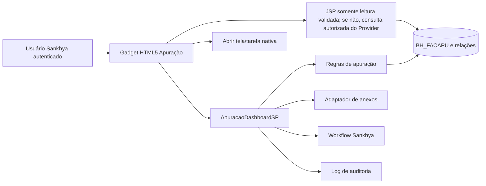
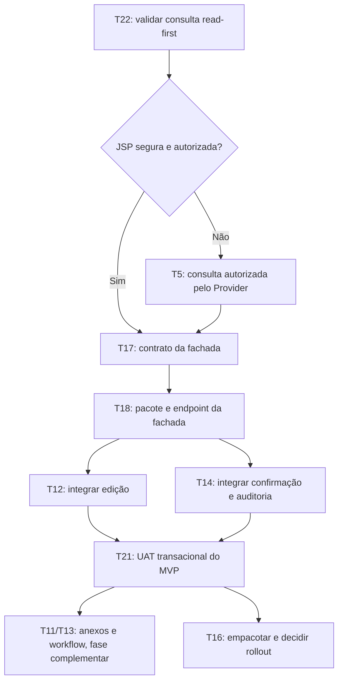
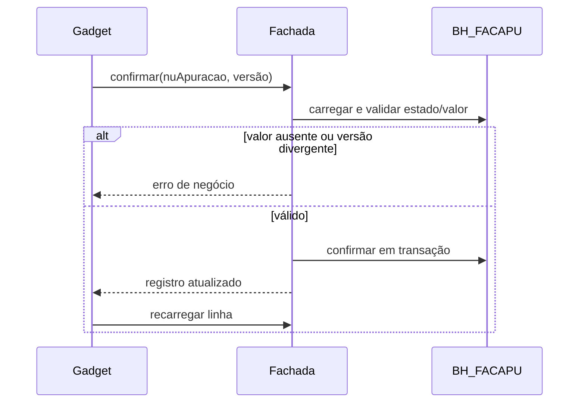

# Dashboard de Apuração de Faturas — Desenho técnico

**Especificação:** `spec.md`  
**Estado:** aprovado para execução read-first; T22 valida a consulta e T17
consolida somente o contrato MVP de comandos.

## Local de implementação

O novo gadget será desenvolvido isoladamente no projeto HTML5, em:

```
C:\projetos\sankhya-html5\facilita\apuracao-faturas\
├── tdb_dashboard.xml
├── tdb_partida.jsp
├── dados.jsp
├── detalhe_payload.jsp
├── erro.jsp
├── javascript\script.js
└── css\style.css
```

O ZIP de publicação continuará tendo esses arquivos em sua raiz, como exige o mecanismo de Upload Pacote HTML. O projeto `facilitatelecoment` é exclusivamente a fonte de levantamento de comportamento; nenhum arquivo dele será compilado, copiado ou publicado.

## Direção da interface

- **Propósito e público:** console de trabalho para analistas que tratam apurações, não um painel executivo.
- **Tom:** operacional e utilitário, com densidade controlada e leitura rápida de tabela; sem cards decorativos ou métricas sem ação.
- **Hierarquia:** filtro compacto no topo, lista como área dominante, detalhes da seleção em painel lateral ou abaixo da tabela e ações transacionais agrupadas pelo estado da apuração.
- **Diferencial:** a própria linha comunica seu estado (`pendente`, `confirmada`, `em auditoria`, `com anexo`) por rótulo textual e cor acessível, sem exigir que o usuário abra o detalhe.
- **Responsividade:** em telas estreitas, filtros recolhem, a tabela preserva colunas-chave com rolagem horizontal e as ações permanecem disponíveis no detalhe selecionado.
- **Estados obrigatórios:** carregando, vazio, erro, sucesso de ação, conflito de atualização e ausência de permissão; todos com texto claro, foco visível e uso por teclado.

## Decisão adotada

Construir uma solução nova e isolada em duas fronteiras, seguindo o padrão de migração incremental (Strangler Fig):

1. **Dashboard/gadget HTML5 de consulta**, filtros, seleção, informações não sensíveis e exportação. Ele não usa a grade Angular, `GridConfig` nem o código web legado.
2. **Fachada transacional própria**, em novo pacote de backend da Facilita, para salvar valor/vencimento, confirmar, solicitar nova auditoria, gerir anexos e consultar workflow. Ela encapsula regras e retorna erros de negócio ao navegador. A UI somente chama essa fachada após validar o contrato em homologação.

O gadget pode atender a consulta rapidamente. Para substituir integralmente a tela, a fachada é necessária; depender diretamente dos serviços legados `ApuracaoSP`, `AnexoSistemaSP` e `BHAnexoServiceSP` não é seguro enquanto o artefato instalado não for identificado e testado.

Na recuperação inicial, `dados.jsp` e `detalhe_payload.jsp` podem permanecer
como caminho de leitura somente se parâmetros, projeção e autorização forem
validados no Om. A UI não tem autorização para decidir o escopo dos dados nem
para gravar. Se a consulta JSP não passar esse gate, a lista/detalhe deve usar
um endpoint de leitura autorizado da fachada antes de liberar o gadget.

O Provider deve ser um módulo de interface pequena e implementação profunda:
o gadget envia comandos sem conhecer JAPE, regras de estado, política de
usuário ou detalhes de transação. Sua seam não inclui chamadas manuais de
gravação do navegador.

O layout não precisa reproduzir pixel a pixel a tela atual. A equivalência será medida pelos requisitos APU-01 a APU-16, pela autorização do usuário e pela consistência dos estados após cada operação.

## Alternativas

| Alternativa | Vantagens | Limitações | Veredito |
| --- | --- | --- | --- |
| Corrigir a tela Angular atual | Menor mudança aparente. | Requer republicar fonte não comprovado; mantém API obsoleta. | Rejeitada para este escopo. |
| Gadget HTML5 somente com consultas | Isolado, sem `sk-datagrid`, rápido para recuperar leitura. | Não resolve com segurança anexos e transições de estado. | Viável como fase 1. |
| Gadget HTML5 + fachada nova | Isola legado e mantém a tela dentro do ERP; comandos auditáveis. | Exige desenvolvimento e homologação de contratos. | **Adotada.** |
| Tela HTML5 customizada em add-on novo | Maior liberdade para UX complexa, anexos e edição. | Mais trabalho de UI; não é um gadget de dashboard. | Plano B se o gadget limitar operações. |

## Arquitetura proposta



## Desenho de execução



O T22 valida a consulta independentemente da publicação da fachada. O T17
consolida somente o contrato MVP de edição, confirmação e nova auditoria; não
espera captura de anexos/workflow. O T18 é implementado no repositório separado
do Add-on e depende das tasks T15/T16 daquela feature. O arquivo
[`contracts.md`](contracts.md) continua sendo o artefato vivo do contrato.

## Componentes e contratos

| Componente | Responsabilidade | Dependências / validações |
| --- | --- | --- |
| `tdb_dashboard.xml` | Define nível, permissões e parâmetros iniciais do gadget. | Confirmar versão mínima do Om e empacotamento aceito pelo cliente. |
| `tdb_partida.jsp` + JS/CSS | Renderiza filtro, tabela própria, painel da seleção, modal e estados de erro. | `snk:load`; nenhuma dependência de Angular/`GridConfig`. |
| Consulta de lista | Retorna colunas explicitamente permitidas, paginação, ordenação e filtros. | Revisar SQL, índices e filtro por permissão antes de liberar. |
| `ApuracaoDashboardSP.listarDetalhe` | Retorna apenas dados do registro selecionado e mascarados conforme perfil. | Não retornar senha nem credencial por padrão; contrato em `contracts.md`. |
| `ApuracaoDashboardSP.atualizar` | Atualiza somente `VALOR` e `DTVENC`; usa versão/estado para detectar concorrência. | Regras de valor/vencimento a confirmar; sem update direto no JSP. |
| `ApuracaoDashboardSP.confirmar` | Encapsula APU-10 e APU-11. | Deve ser atômico e devolver erro de negócio; não engolir exceções. |
| `ApuracaoDashboardSP.solicitarNovaAuditoria` | Encapsula APU-12 e valida `BH_NOVAAUDIT`. | Deve registrar usuário, antes/depois e motivo. |
| Adaptador de anexos | Valida arquivo/tipo, envia, associa à apuração e abre visualização autorizada. | Validar tamanho, extensão/MIME, antivírus e contrato do repositório de anexos antes do T20. |
| Integração de workflow | Consulta tarefa pendente e abre a tela Sankhya nativa. | Validar `IDINSTPRN`, `IDINSTTAR` ou outro identificador antes do T20. |
| Preferências da visão | Salva colunas e ordenação sob chave nova, por usuário. | Não ler/gravar o namespace de `GridConfig` legado. |

## Fluxos transacionais

### Confirmar



### Anexar

```mermaid
sequenceDiagram
    participant UI as Gadget
    participant SP as Fachada
    participant AS as Serviço de anexos
    participant DB as BH_FACAPU
    UI->>SP: validar arquivo e tipo
    SP->>AS: enviar e associar
    alt falha de envio/associação
        SP-->>UI: erro; nenhum “possui anexo” confirmado
    else sucesso
        SP->>DB: registrar vínculo/estado em transação compensável
        SP-->>UI: anexo associado
    end
```

## Reutilização e limites do legado

| Recurso observado | Reutilizar? | Condição |
| --- | --- | --- |
| Tabelas `BH_FACAPU`, `BH_FACCON`, `BH_FACCCT`, `BH_FACCTR` | Sim, como fonte a validar. | Comparar metadados e resultados em homologação. |
| `ApuracaoSP.confirmar` / `getTarefa` | Não como dependência inicial. | Só reutilizar após prova de versão, contrato e tratamento de erro. |
| `AnexoSistemaSP.salvar` / `BHAnexoServiceSP.atualizaTipoAnexo` | Não como dependência inicial. | Validar contrato, autorização e compensação de falha. |
| `BH_VFACAPU` / job `PreparaApuracaoSP` | Sim, como regra de geração a preservar. | Confirmar agenda, dados de referência e impacto de registros pendentes. |
| Grade e filtro Angular | Não. | São a origem da falha e usam APIs não comprovadas. |

## Riscos e bloqueios

| Risco / bloqueio | Evidência | Mitigação exigida |
| --- | --- | --- |
| Fonte não corresponde ao deploy | Checkout muito alterado; artefato visto nos logs não foi mapeado a commit. Risco aceito pelo solicitante. | Usar como referência funcional e validar cada fluxo em homologação antes de liberar escrita. |
| Incompatibilidade de plataforma | `GridConfig.getSelectedColumns` falha e a dependência foi introduzida em 2020. | Não usar APIs da grade antiga; validar o gadget num Om igual ao cliente. |
| Falha silenciosa em serviço | `ApuracaoSP.confirmar` registra exceções genéricas e retorna `Sucesso`. | Fachada nova deve propagar erro estruturado e só responder sucesso após commit. |
| Exposição de credenciais | HTML atual imprime login, senha, CPF/CNPJ e e-mail. | Classificação de dados, perfis e mascaramento antes de incluir detalhes. |
| Consulta direta contornar autorização | Gadget pode executar SQL sob a sessão do usuário. | SQL mínimo, parâmetros vinculados, whitelist de colunas e teste por perfil. |
| Corrida de edição | Dois usuários podem alterar a mesma apuração. | Controle de versão/estado e recarga após todo comando. |
| Anexo parcialmente associado | O legado altera a linha e chama serviços em etapas. | Serviço único/compensação e teste de falhas em cada etapa. |
| Desempenho | Relações e busca dinâmica do legado podem produzir consultas caras. | Paginar, limitar exportação e medir planos/índices em homologação. |

## Portões antes de implementar

1. Registrar a versão do Sankhya Om do cliente para reproduzir a homologação, sem bloquear o uso do fonte como referência funcional.
2. Capturar primeiro requests/responses e permissões de editar, confirmar e
   nova auditoria; anexos e workflow têm captura e homologação próprias depois.
3. Comparar uma amostra de ao menos 20 registros, incluindo pendente, confirmado, com anexo, sem valor e com tarefa.
4. Aprovar a matriz de dados sensíveis e os perfis de acesso.
5. Confirmar o mecanismo de registro do novo pacote e o nome físico dos endpoints da fachada.
6. Usar a tela HTML5 customizada como plano B caso anexos/edição não caibam no gadget.

## Referências externas verificadas

- A documentação oficial Sankhya descreve telas HTML5 customizadas como adequadas quando a UI exige controle total e recomenda manter regra de negócio fora da view: [Telas Personalizadas](https://developer.sankhya.com.br/docs/07_telas).
- Dashboards podem ser embarcados no add-on e exigem versão mínima específica para dashboards contextualizados: [Dashboards Embarcados](https://developer.sankhya.com.br/docs/04_dashboard).
- A plataforma documenta `openApp` para abrir telas nativas em interações de dashboard: [Eventos de Click no iReport](https://developer.sankhya.com.br/docs/eventos-de-click-no-ireport).
