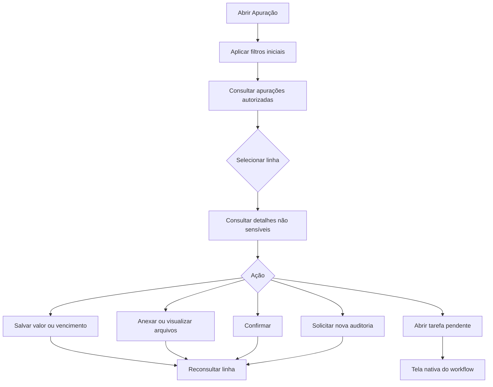

# Dashboard de Apuração de Faturas — Especificação (rascunho)

**Status:** especificação de referência pronta; risco de divergência do fonte legado aceito pelo solicitante. Implementação e deploy permanecem sujeitos aos portões de homologação.

## Problema

A tela legada `Apuração de Faturas` carrega os dados e, após a criação da grade, executa `GridConfig.getSelectedColumns(...)`. No ambiente do cliente, a função não existe no objeto global `GridConfig`, gerando `GridConfig.getSelectedColumns is not a function`. A requisição `GridConfig.getGridConfigFromJson` retornar HTTP 200 confirma que a falha acontece no cliente, depois da resposta.

O checkout disponível em `C:\projetos\facilitatelecoment` não é uma base confiável de publicação: há alterações locais extensas e não há evidência que o associe ao artefato instalado `facilitatelecom-0.0.14457-botaoAcaoAnexo.jar` visto nos logs. Portanto, esta especificação não autoriza build ou deploy desse checkout.

## Objetivos

- [ ] Disponibilizar a consulta de apurações sem usar `sk-datagrid`, `GridConfig` ou Angular legado.
- [ ] Reproduzir as funções de negócio necessárias da tela com contratos explicitamente validados no ambiente de homologação.
- [ ] Preservar autorização, consistência de transações e rastreabilidade das operações.
- [ ] Permitir implantação isolada em um novo pacote, sem recompilar o add-on legado.

## Fora de escopo

| Item | Motivo |
| --- | --- |
| Corrigir ou republicar a tela Angular legada | O fonte não foi comprovado como correspondente ao instalado. |
| Alterar tabelas, fluxos ou regras de faturamento existentes | A tela substituta deve inicialmente consumir as regras vigentes. |
| Tela `Autorização de Faturas` / envio de e-mails | É outro resource ID e requer levantamento próprio. |
| Exibir senhas ou demais credenciais de operadora | O legado as expõe na UI; a nova solução só poderá fazê-lo com aprovação explícita de segurança. |
| Deploy em produção | Depende de homologação, aceite funcional e estratégia de reversão. |

## Evidências do levantamento

| Evidência | Conclusão |
| --- | --- |
| `Apuracao.js:129-142` | O erro é disparado em `onDagridCreated`, após o carregamento da grade. |
| `Apuracao.js:33` | `GridConfigInstance(...)` é instanciado, mas o código chama o global `GridConfig`; o objeto instanciado não é usado. |
| Histórico Git `562bec2` (29/10/2020) | A dependência da configuração de grade foi introduzida há anos; há forte indício de API incompatível, não de falha do endpoint. |
| Sem ocorrência do erro no `server.log` fornecido | O erro é de JavaScript no navegador; os logs de servidor não o registram. |
| `Apuracao.xml` e regras Java/Kotlin | A entidade observada é `bhApuracao` / tabela `BH_FACAPU`; confirmações, anexos e fluxo têm regras adicionais. |

## Escopo funcional observado

| Capacidade | Comportamento atual observado | Prioridade |
| --- | --- | --- |
| Listar apurações | Consulta `bhApuracao`, com uma linha selecionada por vez. | P1 |
| Filtros fixos | Mês de referência (inicia no mês corrente), somente pendentes (inicia ativo) e possui anexo. | P1 |
| Pesquisa dinâmica | Campo selecionável conforme as colunas visíveis; busca por texto, número, data, hora, lista ou entidade. | P1 |
| Edição | Somente `DTVENC` e `VALOR` são editáveis. | P1 |
| Anexar | Um arquivo por operação, com tipo: Original, 2ª via, Ajustada, Boleto, Nota Fiscal ou Resumida. | P1 |
| Ver anexos | Abre o visualizador de arquivos para a apuração selecionada. | P1 |
| Confirmar | Marca a apuração como confirmada, desde que possua valor. | P1 |
| Solicitar nova auditoria | Para apuração confirmada, reinicia campos do processo; exige permissão `BH_NOVAAUDIT = S`. | P1 |
| Abrir tarefa | Duplo clique abre a tarefa pendente do workflow. | P2 |
| Exportar / imprimir | A grade expõe impressão e contador; há configuração de colunas e filtro personalizado. | P2 |
| Abrir site da operadora | Existe função, mas o botão está comentado no HTML. | P3 |

## Histórias e critérios de aceite

### P1 — Consultar e filtrar apurações

Como analista de faturamento, quero consultar e filtrar as apurações do mês para localizar rapidamente uma conta.

- **APU-01:** QUANDO a tela for aberta, ENTÃO o sistema DEVE mostrar apurações do primeiro dia do mês corrente e aplicar “somente pendentes”, conforme o comportamento vigente validado em homologação.
- **APU-02:** QUANDO o usuário alterar mês, pendência, anexo ou critério de pesquisa, ENTÃO a lista DEVE refletir exatamente a combinação informada e apresentar estado vazio compreensível.
- **APU-03:** QUANDO os dados ou a consulta falharem, ENTÃO a tela DEVE informar a falha, registrar o correlation ID e não apresentar dados parciais como completos.

### P1 — Ajustar dados da apuração

Como analista autorizado, quero alterar valor e vencimento antes da confirmação.

- **APU-04:** QUANDO uma linha for selecionada, ENTÃO somente `VALOR` e `DTVENC` DEVEM estar disponíveis para edição.
- **APU-05:** QUANDO a alteração for salva, ENTÃO a tela DEVE confirmar a persistência e recarregar a linha a partir da fonte de dados.
- **APU-06:** QUANDO valor ou vencimento forem inválidos, ENTÃO o sistema DEVE rejeitar a gravação e explicar a regra violada.

### P1 — Gerir anexos

Como analista, quero vincular e consultar o arquivo de uma apuração.

- **APU-07:** QUANDO for selecionado um arquivo e seu tipo, ENTÃO o sistema DEVE associá-lo somente à apuração selecionada e indicar o resultado da operação.
- **APU-08:** QUANDO houver mais de um arquivo ou nenhum tipo, ENTÃO o sistema DEVE impedir o envio antes de persistir qualquer alteração.
- **APU-09:** QUANDO o usuário abrir anexos, ENTÃO o sistema DEVE apresentar somente arquivos aos quais ele tem acesso.

### P1 — Confirmar ou solicitar nova auditoria

Como analista autorizado, quero confirmar a apuração ou reiniciar sua auditoria quando permitido.

- **APU-10:** QUANDO uma apuração não confirmada com valor for confirmada, ENTÃO seu estado DEVE ser persistido de forma atômica e a linha recarregada.
- **APU-11:** QUANDO uma apuração sem valor for confirmada, ENTÃO o sistema DEVE recusar a operação sem alterar estado.
- **APU-12:** QUANDO uma apuração confirmada receber solicitação de nova auditoria, ENTÃO o sistema DEVE exigir `BH_NOVAAUDIT = S` e, se autorizado, limpar `IDINSTPRN`, confirmação, auditoria finalizada, e-mail enviado e liberação de faturamento em uma única transação.

### P2 — Navegar para a tarefa do workflow

Como analista, quero abrir a tarefa pendente da apuração selecionada.

- **APU-13:** QUANDO houver tarefa pendente e o usuário solicitar a abertura, ENTÃO a tela DEVE abrir a tarefa correspondente ao `IDINSTPRN` da apuração.
- **APU-14:** QUANDO não houver tarefa pendente, ENTÃO a tela DEVE informar isso sem erro técnico.

### P2 — Personalizar a visão e exportar

Como analista, quero escolher colunas e exportar o resultado sem depender da API legada de configuração de grade.

- **APU-15:** QUANDO o usuário alterar colunas ou ordenar a lista, ENTÃO a preferência DEVE ser salva com uma chave nova, isolada da configuração legada.
- **APU-16:** QUANDO exportar a lista filtrada, ENTÃO o arquivo DEVE conter somente as colunas visíveis e as linhas que o usuário pode consultar.

## Fluxo de negócio proposto

## Assunções e questões em aberto

| Decisão / lacuna | Padrão adotado no rascunho | Motivo | Confirmada? |
| --- | --- | --- | --- |
| Artefato efetivamente instalado | Usar o checkout legado como referência funcional, assumindo o risco de divergência; validar comportamento em homologação. | Risco explicitamente aceito pelo solicitante; não há manifesto do JAR instalado. | Sim |
| Forma da UI | Avaliar gadget HTML5 para consulta e um add-on HTML5 isolado para paridade transacional. | Gadget é adequado a visualização; anexos e mudanças de estado precisam de contrato server-side. | Não |
| Dados sensíveis | Omitir senha, CPF/CNPJ e dados de contato até definição de perfil e mascaramento. | O legado expõe dados sensíveis na interface. | Não |
| Persistência de colunas | Nova preferência com namespace próprio. | Evita a API `GridConfig` que falhou e qualquer conflito com dados legados. | Não |
| Semântica de filtros | Replicar somente após comparar amostra de resultados em homologação. | O filtro legado contém SQL/metadata dinâmicos e relações não verificadas no cliente. | Não |

## Dimensões implícitas

| Dimensão | Tratamento |
| --- | --- |
| Validação | Valor, vencimento, arquivo único e tipo de anexo; regras exatas serão extraídas da homologação. |
| Falha parcial | Operações de anexo, alteração e confirmação exigem resposta explícita e reconsulta; não há “Sucesso” em erro interno. |
| Idempotência | Upload e confirmação precisam de chave/estado para impedir duplicação ao repetir a ação. |
| Autorização | Consultas e comandos devem respeitar usuário Sankhya; nova auditoria exige `BH_NOVAAUDIT`. |
| Concorrência | Alterações devem detectar versão/estado modificado antes de gravar. |
| Observabilidade | Toda ação transacional terá correlation ID, usuário, apuração, resultado e motivo de rejeição. |
| Dependência externa | Serviços de anexo e workflow são bloqueadores até validação de contrato. |
| Transição de estado | Confirmar e reabrir auditoria serão comandos atômicos, nunca updates dispersos pela UI. |

## Critérios de sucesso do levantamento

- [ ] Cada capacidade P1 possui fonte de dados, autorização e contrato de escrita ou bloqueio documentado.
- [ ] Uma prova em homologação compara resultados do legado e da nova consulta para cenários representativos.
- [ ] Nenhum teste de aceitação depende de `GridConfig.getSelectedColumns`.
- [ ] A decisão de arquitetura e o tratamento de dados sensíveis foram aprovados antes da implementação.
